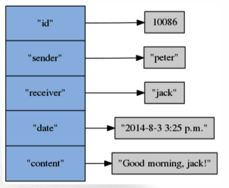

# 散列(hash)
* 一个散列由多个域值对(field-value pair)组成,散列的域和值都可以是文字,整数,浮点数或二进制数据.
* 同一个散列里面的每个域必须是独一无二,各不相同的,而域的值则没有要求,即不同域的值可以是重复的.
* 通过命令,用户可以对散列执行
  - 设置域值对
  - 获取域的值
  - 检查域是否存在
  - 返回散列包含的所有域,所有值,所有域值对等等


## 基本操作
### 关联域值对
```
HSET key field value
```
* 在散列键key中关联给定的域值对field和value
* 如果域field之前没有关联值,那么命令返回1
* 如果域field已经有关联值,那么命令用新值覆盖旧值,并返回0
* 复杂度为O(1)
```
HSET msg "id" 10086
HSET msg "sender" "peter"
HSET msg "receiver" "jack"
```
### 获取域关联的值
```
HGET key field
```
* 返回散列键key中,域field所关联的值
* 如果域field没有关联值,那么返回nil
* 复杂度O(1)
```
HGET msg "id"
HGET msg "sender"
HGET msg "content"
```
### 仅当域不存在时,关联域值对
```
HSETNX key field value
```
* 如果散列键key中,域field不存在(就是还没有关联的值),那么关联给定的域值对field和value.
* 如果域field已经有与之相关联的值,那么命令不做动作.
* 复杂度O(1)
```
HSETNX msg "content" "Good morning"
HSETNX msg "content" "asdfsaf"
0 # 不做动作
```
### 检查域是否存在
```
HEXISTS key field
```
* 查看散列键key中,给定域field是否存在
* 存在返回1
* 不存在返回0
* 复杂度为O(1)
```
HEXISTS msg "id"
HEXISTS msg "content"
```
### 删除给定的域值对
```
HDEL key field [field...]
```
* 删除散列键key中的一个或多个指定域,以及这些域的值
* 不存在被忽略
* 返回被成功删除的数量
* 复杂度为O(N),N为被删除的个数
```
HDEL msg "id" "content" "receiver"
```
### 获取散列包含的键值对数量
```
HLEN key
```
* 返回散列键key包含的域值对数量
* 复杂度为O(1)
```
HLEN msg
HDEL msg "date"
HLEN msg
```
## 批量操作
### 一次设置或获取散列中的多个域值对
```
HMSET key field value [field value ...]
```
* 在散列键key中关联多个域值对,相当于执行多个HSET
* 复杂度O(N),N为域值对数量

```
HMGET key field value [field ...]
```
* 返回散列键key中,一个或多个域的值,相当于同时执行多个HGET
* 复杂度O(N),N为域值对数量

```
HMSET msg "id" 10086 "sender" "peter" "receiver" "jack"
OK
HMGET mesg "id" "sender" "receiver"
1) "10086"
2) "peter"
3) "jack"
```
### 获取散列包含的所有域,值,或者域值对
```
HKEYS key
```
* 返回散列键key包含的所有域
* 复杂度O(N)

```
HVALS key
```
* 返回散列键key中,所有域的值
* 复杂度O(N)

```
HGETALL key
```
* 返回散列键key包含的所有域值对
* 复杂度O(N)

```
HKEYS msg # 获取所有域
HVALS msg # 获取所有值
HGETALL msg # 获取所有域值对
```

### 数字操作
