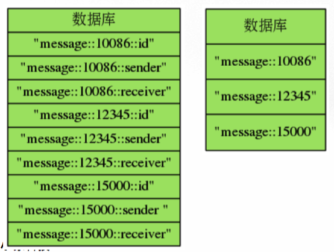

# 散列(hash)
* 一个散列由多个域值对(field-value pair)组成,散列的域和值都可以是文字,整数,浮点数或二进制数据.
* 同一个散列里面的每个域必须是独一无二,各不相同的,而域的值则没有要求,即不同域的值可以是重复的.
* 通过命令,用户可以对散列执行
  - 设置域值对
  - 获取域的值
  - 检查域是否存在
  - 返回散列包含的所有域,所有值,所有域值对等等


## 基本操作
### 关联域值对
```
HSET key field value
```
* 在散列键key中关联给定的域值对field和value
* 如果域field之前没有关联值,那么命令返回1
* 如果域field已经有关联值,那么命令用新值覆盖旧值,并返回0
* 复杂度为O(1)
```
HSET msg "id" 10086
HSET msg "sender" "peter"
HSET msg "receiver" "jack"
```
### 获取域关联的值
```
HGET key field
```
* 返回散列键key中,域field所关联的值
* 如果域field没有关联值,那么返回nil
* 复杂度O(1)
```
HGET msg "id"
HGET msg "sender"
HGET msg "content"
```
### 仅当域不存在时,关联域值对
```
HSETNX key field value
```
* 如果散列键key中,域field不存在(就是还没有关联的值),那么关联给定的域值对field和value.
* 如果域field已经有与之相关联的值,那么命令不做动作.
* 复杂度O(1)
```
HSETNX msg "content" "Good morning"
HSETNX msg "content" "asdfsaf"
0 # 不做动作
```
### 检查域是否存在
```
HEXISTS key field
```
* 查看散列键key中,给定域field是否存在
* 存在返回1
* 不存在返回0
* 复杂度为O(1)
```
HEXISTS msg "id"
HEXISTS msg "content"
```
### 删除给定的域值对
```
HDEL key field [field...]
```
* 删除散列键key中的一个或多个指定域,以及这些域的值
* 不存在被忽略
* 返回被成功删除的数量
* 复杂度为O(N),N为被删除的个数
```
HDEL msg "id" "content" "receiver"
```
### 获取散列包含的键值对数量
```
HLEN key
```
* 返回散列键key包含的域值对数量
* 复杂度为O(1)
```
HLEN msg
HDEL msg "date"
HLEN msg
```
## 批量操作
### 一次设置或获取散列中的多个域值对
```
HMSET key field value [field value ...]
```
* 在散列键key中关联多个域值对,相当于执行多个HSET
* 复杂度O(N),N为域值对数量

```
HMGET key field value [field ...]
```
* 返回散列键key中,一个或多个域的值,相当于同时执行多个HGET
* 复杂度O(N),N为域值对数量

```
HMSET msg "id" 10086 "sender" "peter" "receiver" "jack"
OK
HMGET mesg "id" "sender" "receiver"
1) "10086"
2) "peter"
3) "jack"
```
### 获取散列包含的所有域,值,或者域值对
```
HKEYS key
```
* 返回散列键key包含的所有域
* 复杂度O(N)

```
HVALS key
```
* 返回散列键key中,所有域的值
* 复杂度O(N)

```
HGETALL key
```
* 返回散列键key包含的所有域值对
* 复杂度O(N)

```
HKEYS msg # 获取所有域
HVALS msg # 获取所有值
HGETALL msg # 获取所有域值对
```

## 数字操作
和字符串键的值一样,散列里面域的值也可以被解释为数字,并执行相应的数字操作.
### 对域的值执行自增操作
```
HINCRBY key field increment
```
* 为散列键key中,域field的值加上整数增量increment
* 复杂度O(1)

```
HINCRBYFLOAT key field increment
```
* 为散列键key中,域field的值加上浮点数增量increment
* 复杂度O(1)

** 虽然Redis没有提供和上面两个命令相匹配的HDECRBY和HDECRBYFLOAT命令,但可以通过将increment设为负数来达到减法的效果 **

```
HINCRBY numbers x 100
HINCRBY numbers x -50
HINCRBYFLOAT numbers x 3.14
```

## 散列键和字符串键
### 效果类似的命令
```
HSET - SET
HGET - GET
HSETNX - SETNX
HDEL - DEL(删除一个键,不仅限于字符串键)
HMSET - MSET
HMGET - MGET
HINCRBY - INCRBY
HINCRBYFLOAT - INCRBYFLOAT
HEXISTS - EXISTS(检查一个键是否存在,不仅限于字符串键)
```
### 使用散列的好处(1):将数据放到同一个地方
* 将一些相关的信息存储在同一个地方,而不是直接分散的存储在整个数据库里.
* 方便了数据管理,避免了误操作发生.

### 使用散列的好处(2):避免键名冲突
可以在命名键的时候,使用分割符来避免命名冲入,但更好的办法就是直接使用散列键来存储键值对数据.

随着域数量的增加,使用散列会比使用字符串少创建很多数据库键.

### 使用散列的好处(3):减少内存占用
一般情况下,保存相同数量的键值对信息,使用散列键比使用字符串键更节约内存.

因为在数据库里面创建的每个键都带有数据库附加的管理信息(比如这个键的类型、最后一次被访问的时间等等),所以数据库里面的键越多,服务器在储存附加管理信息方面耗 费的内存就越多,花在管理数据库键上的CPU也会越多.

除此之外,当散列包含的域值对数量比较少的时候,Redis会自动使用一种占用内存非常少的数据结构来做散列的底层实现,在散列的数量比较多的时候,这一措施对减少内存有很大的帮助.

### 没办法使用散列键来代替字符串键的情况
1. 使用二进制位操作命令:因为Redis目前支持对字符串键进行SETBIT,GETBIT,BITOP等操作,如果使用这些操作,只能使用字符串键.
2. 使用过期功能:Redis的键过期功能目前只能对字符串键进行过期操作,而不能对散列的域进行过期操作,因此如果对键值对数据使用过期功能的话,那么只能把键值对储存在字符串里面.

### 示例:使用散列重新实现计算器
```
Counter(name, client):设置计数器的名字以及客户端
Counter.incr():将计数器的值增一,然后返回计数器的值,调用HINCRBY命令
Counter.get():返回计数器当前的值,调用HGET命令
Counter.reset(n=0):将计数器的值重置为n,默认重置为0,调用HGET命令和HSET命令
```
这个计数器的功能和API,跟之前用字符串键实现的计数器完全一样,不同之处在于,这个实现会将所有计数器都存储在同一个散列里面,一个域值对就是一个计数器.
```

```