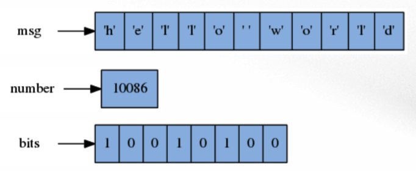
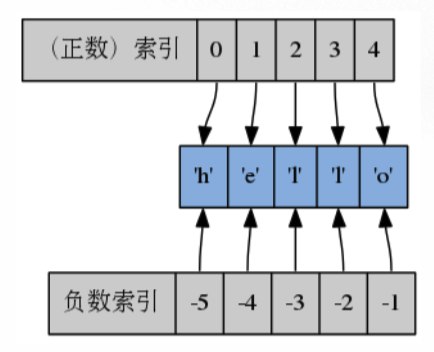
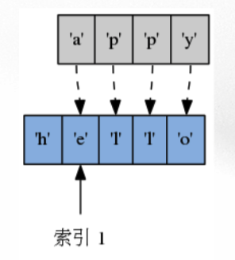
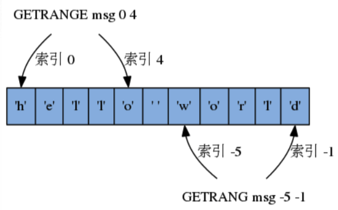

# 字符串

Redis中最简单的数据结构,存储文字,数字或者二进制数据.这几种类型分别设置了相应的操作命令,可以针对不同的值做不同的处理.  
  
三个字符串分别存储了文字\(msg\),数字\(number\)以及二进制数据\(bits\).

### 基本操作

#### 为字符串键设置值

```
SET key value
```

* 将字符串键key的值设置为value,命令返回OK表示设置成功.
* 如果字符串键key已经存在,那么用新值覆盖原来的旧值.
* 复杂度:O\(1\)

```
SET key value [NX|XX]
```

SET命令还支持可选项NX和XX:

* 给定NX选项,那么命令仅在键key不存在的情况下,才进行设置操作,如果key已经存在,则不做操作\(即不会覆盖旧值\).
* 给定XX选项,那么命令仅在键key存在的情况下,才进行设置操作,也就是说一定会覆盖旧的,如果没有旧的就不操作.

注:在NX和XX选项给定的情况下,SET命令设置成功返回OK,失败返回nil.

#### 获取字符串的值

```
GET key
```

* 返回字符串键key存储的值
* 复杂度为O\(1\)

#### 仅在键不存在的情况下进行设置

```
SETNX key value
```

仅在键key不存在的情况下,将键key的值设置为value,效果和SET key value NX一样.NX的意思就是"Not eXists\(不存在\)".

* 键不存在并且设置成功时,命令返回1
* 键已经存在而导致设置失败时,命令返回0
* 复杂度为O\(1\)

#### 同时设置或获取多个字符串键的值

* MSET key value \[key value...\]
* 一次为一个或多个字符串键设置值,效果和同时执行多个SET命令一样,命令返回OK
* O\(N\)复杂度,N为字符串键的数量

* MGET key \[key...\]

* 一次返回一个或多个字符串键的值,效果和同时执行多个GET命令一样

* O\(N\)复杂度,N为要获取的字符串键的数量

**设置或获取个人信息 **

通过MSET和MGET一次性设置和获取用户名,电子邮件,个人网站等信息.

```
MSET test::email "test@qq.com" test::homepage "http://test.com"
MGET test::email test::homepage
```

#### 键的命名

因为Redis的数据库不能出现两个同名的键,所有通常会使用field1::,field2::这样的格式来区分同一类型的字符串键.::是分隔符,当然也可以根据个人喜好设置分隔符,比如test/email,test\|email等等.

```
一些复杂的分隔符:
user::10086::info - ID为10086的用户的信息
news::sport::cache - 新闻网站体育分类的缓存
message::123321::content - ID为123321的消息的内容
```

#### 一次设置多个不存在的键

```
MSETNX key value [key value...]
```

* 只有在所有给定键都不存在的情况下,MSETNX会为所有给定键设置值,效果和同时执行多个SETNX一样.如果给定的键至少有一个是存在的,那么将设置失败.
* 返回1表示设置成功,返回0表示设置失败.
* 复杂度为O\(N\),N为给定的键数量.

#### 设置新值并返回旧值

```
GETSET key new-value
```

* 将字符串键的值设置为new-value,并返回字符串键在设置新值之前存储的就的值\(old value\).
* 复杂度为O\(1\)

** 用伪代码表示GETSET的定义 **

```
def GETSET(key, new-value)
old-value = GET(key) # 记录旧值
SET(key, new-value) # 设置新值
return old-value # 返回旧值
```

#### 追加内容到字符串末尾

```
APPEND key value
```

* 将值value推入到字符串键key已存储内容的末尾,返回值的长度
* O\(N\)复杂度,其中N为被推入值的长度
* 向一个不存在的键key末尾追加会新创建一个key-value

#### 返回值的长度

```
STRLEN key
```

* 返回字符串键key存储的值的长度
* 因为Redis会记录每个字符串值的长度,所以获取该值的长度的复杂度为O\(1\)

---

### 索引和范围

#### 索引

字符串的索引\(index\)以0为开始,从字符串的开头向字符串的结尾依次递增,字符串第一个字符的索引为0,最后一个字符索引为N-1,N为字符串的长度.

除了正数索引之外,字符串还有负数索引,以-1为开始,从字符串的结尾向字符串的开头依次递减,最后一个字符的索引为-N,其中N为字符串的长度.  


#### 范围设置

```
SETRANGE key index value
```

* 从索引index开始,用value覆写\(overwrite\)给定键key所存储的字符串值\(只接受正数索引\)
* 命令返回覆写之后字符串值的长度,复杂度为O\(N\),N为value的总长度

  

#### 范围取值

```
GETRANGE key start end
```

* 返回键key存储的字符串值中start和end两个索引之间的内容\(包含start和end\)

* GETRANGE的索引可以是正数或负数

* 复杂度为O\(N\),N为被选中内容的长度

  

---

### 数字操作

#### 设置和获取数字

只要储存在字符串键里面的值可以被解释为64位整数,或者IEEE-754标准的64位浮点数,那么用户就可以对这个字符串键执行针对数字值的命令.

```
例如:
10086 - 可以
3.14 - 可以
+123 - 可以
123456789123456789123456789 - 不可以,太大了
2.0e7 - 不可以,不支持科学计数法
1321ASSF - 不可以,有文字,当然纯文字也不可以
```

#### 增加或者减少数字的值

```
INCRBY key increment
```

* 将key所存储的值加上增量increment,返回操作执行之后键key的当前值.

* 复杂度为O\(1\)

  ```
  DECRBY key decrement
  ```

* 将key所存储的值减去减量decrement,返回操作执行之后键key的当前值.

* 复杂度为O\(1\)  
  如果执行上面的命令时,key不存在,那么会将key初始化0,然后再执行增加或者减少操作.

  ```
  INCRBY num 100
  100
  INCRBY num 25
  125
  DECRBY num 10
  115
  DECRBY num 50
  65
  ```

  ### 增一和减一

  ```
  INCR key
  ```

* 加1,等同于执行INCRBY key 1

* 复杂度O\(1\)

  ```
  DECR key
  ```

* 减1,等同于执行DECRBY key 1

* 复杂度O\(1\)

  ```
  SET num 10
  OK
  INCR num
  11
  DECR num
  10
  ```

  ### 示例:计数器\(counter\)

  很多网站都使用了计数器来记录页面被访问的次数.  
  ** 计数器API及其实现 **

* Counter\(name,client\):设置计数器的名字以及客户端

* Counter.incr\(\):将计数器的值增一,然后返回计数器的值,调用INCR命令

* Counter.get\(\):返回计数器当前的值,调用GET命令

* Counter.reset\(n=0\):将计数器的值重置为n,默认重置为0

  * 调用GETSET命令.虽然使用SET命令也可以达到重置的效果,但使用GETSET可以在重置计数器的同时获得计数器之前的值,这有时候会有用.
    \`\`\`
    # encoding:utf-8

class Counter:  
  def **init**\(self, key, client\):  
    self.key = key  
    self.client = client

def incr\(self, n=1\):  
    counter = self.client.incr\(self.key, n\)  
    return int\(counter\)

def decr\(self, n=1\):  
    counter = self.client.decr\(self.key, n\)  
    return int\(counter\)

def reset\(self, n=0\):  
    counter = self.client.getset\(self.key, n\)  
    if counter is None:  
      counter = 0  
    return int\(counter\)

def get\(self\):  
    counter = self.client.get\(self.key\)  
    if counter is None:

```
### id生成器
很多网站在创建新条目的时候,都会使用id生成器来为条目创建唯一标识符.例如一个论坛每注册一个新用户都会为这个新用户创建一个用户ID,比如12345,然后访问user/12345就可以看到这个用户的个人页面.或者一个用户发一个帖子,这个帖子也会创建一个帖子ID,/topic/10086 就可以看到这个帖子的内容.ID通常都是连续的,比如1003,1004,1005等.

** id生成器API以其实现 **
- IdGenerator(name,client):设置id生成器的名字和客户端
- IdGenerator.gen():生成一个新的自增id,调用INCR命令
- IdGenerator.init(n):保留前n个id,防止抢注,需要在系统开始运作前执行,否则会出现重复id.例如,要保留前一万个id,那么就需要执行IdGenerator.init(10000),这样生成器创建的id就会从10001开始.调用SET命令.
```

# coding:utf-8

class IdGenerator:

def **init**\(self, key, client\):  
    self.key = key  
    self.client = client

def init\(self, n\):  
    self.client.set\(self.key, n\)

def gen\(self\):  
    new\_id = self.client.incr\(self.key\)  
    return int\(new\_id\)

```
### 浮点数的自增和自减
```

INCRBYFLOAT key increment

```
* 为字符串键key存储的值加上浮点数增量increment,命令返回操作执行之后,键key的值
* 没有相应的DECRBYFLOAT,但可以通过给定负值来达到DECRBYFLOAT的效果
* 复杂度为O(1)
```

SET num 10  
OK  
INCRBYFLOAT num 3.14  
"13.14"  
INCRBYFLOAT num -2.04 \# 通过传递负值来达到做减法的效果  
"11.1"

```
** 注意事项 **

即使字符串键储存的是数字值,它也可以执行APPEND、STRLEN、SETRANGE和GETRANGE.当数字值执行这些命令的时候,会先转成字符串再执行命令.
```

SET num 123  
OK  
STRLEN num  
3  
APPEND num 456  
6  
GET num  
123456  
\`\`\`

## 二进制数据操作


