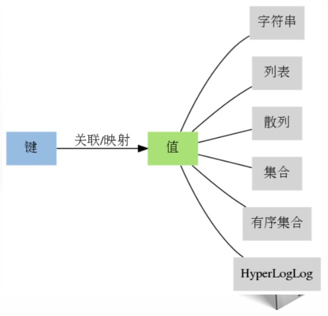

# 初识Redis
* Redis与其他软件的相同之处和不同之处
* Redis的用法
* 使用Python示例代码与Redis进行简单的互动
* 使用Redis解决实际问题

Redis是一个远程内存数据库,提供了5种不同类型的数据结构.通过复制,持久化和客户端分片等特性,可以将Redis扩展成包含数百GB数据,每秒处理上百万次请求的系统.

应用场景:对一个保存了6万个客户联系方式的关系数据库进行搜索,让搜索系统可以根据名字,邮件地址,所在地和电话号码等信息来过滤和排序客户联系方式,并且每次操作都可以在50毫秒之内完成.

## Redis的特色
### 独特的键值对模型
很多数据库只能处理一种数据结构:
* SQL数据库 - 表格
* Memcached - 键值对数据库,键和值都是字符串
* 文档数据库(CouchDB,MongoDB),由JSON/BSON组成的文档(document)
而一旦数据库提供的数据结构不适合去做某件事的话,程序写起来就会非常地麻烦和不自然.

Redis也是键值对数据库,但和Memcached不同的是,Redis的值不仅可以是字符串,还可以是列表,散列,集合等等任意一种数据结构.通过选用不同的数据结构,就可以使用Redis解决各式各样的问题了.

