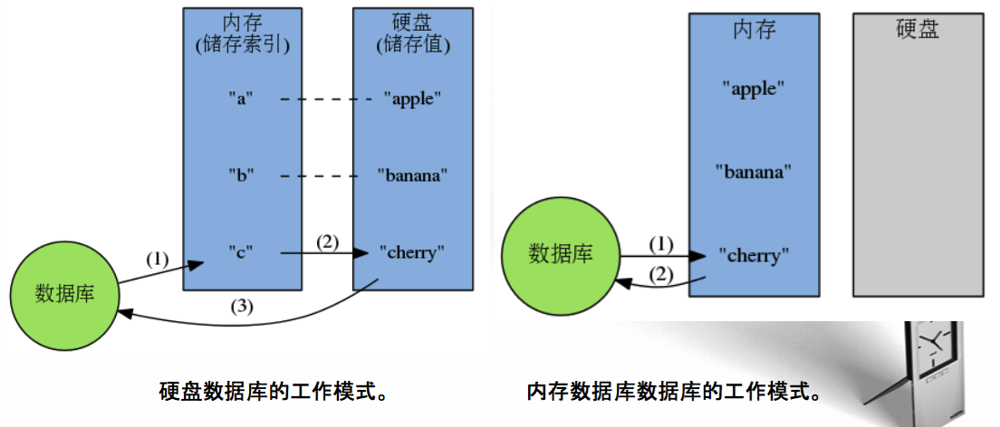

# 初识Redis
* Redis与其他软件的相同之处和不同之处
* Redis的用法
* 使用Python示例代码与Redis进行简单的互动
* 使用Redis解决实际问题

Redis是一个远程内存数据库,提供了5种不同类型的数据结构.通过复制,持久化和客户端分片等特性,可以将Redis扩展成包含数百GB数据,每秒处理上百万次请求的系统.

应用场景:对一个保存了6万个客户联系方式的关系数据库进行搜索,让搜索系统可以根据名字,邮件地址,所在地和电话号码等信息来过滤和排序客户联系方式,并且每次操作都可以在50毫秒之内完成.

## Redis的特色
### 独特的键值对模型
很多数据库只能处理一种数据结构:
* SQL数据库 - 表格
* Memcached - 键值对数据库,键和值都是字符串
* 文档数据库(CouchDB,MongoDB),由JSON/BSON组成的文档(document)
而一旦数据库提供的数据结构不适合去做某件事的话,程序写起来就会非常地麻烦和不自然.

Redis也是键值对数据库,但和Memcached不同的是,Redis的值不仅可以是字符串,还可以是列表,散列,集合等等任意一种数据结构.通过选用不同的数据结构,就可以使用Redis解决各式各样的问题了.

### 内存存储,速度极快
Redis将数据存储在内存里,读写数据的时候都不会受到硬盘I/O速度的限制,所以速度极快.

### 附加功能
* 持久化功能:将储存在内存里面的数据保存到硬盘里面,保障数据安全,方便进行数据备份和恢复.
* 发布与订阅功能:将消息同时分发给多个客户端,用于构建广播系统.
* 过期键功能:为键设置一个过期时间,让它在指定的时间之后自动被删除.
* 事务功能:原子地执行多个操作,并提供乐观锁功能,保证处理数据时的安全性.
* 脚本功能:在服务器端原子地执行多个操作,完成复杂的功能,并减少客户端与服务器之间的通信往返次数.
* 复制:为指定的Redis服务器创建一个或多个复制品,用于提升数据安全性,并分担读请求的负载.
* Sentinel:监控Redis服务器的状态,并在服务器发生故障时,进行自动故障转移.
* 集群:创建分布式数据库,每个服务器分别执行一部分写操作和读操作.

Redis还有完善的文档和良好的支持等特性,被各大公司广泛使用,下面是一些应用场景:
* Twitter使用Redis来储存用户时间线(user timeline)
* StackOverflow使用Redis来进行缓存和消息分发
* Pinterest使用Redis来构建关注模型(follow model)和兴趣图谱(interest graph)
* Flickr使用Redis来构建队列
* Github使用Redis作为持久化的键值对数据库,并使用Resque来实现消息队列
* 新浪微博使用Redis来实现计数器、反向索引、排行榜、消息队列,并储存用户关系
* 知乎使用Redis来进行计数、缓存、消息分发和任务调度