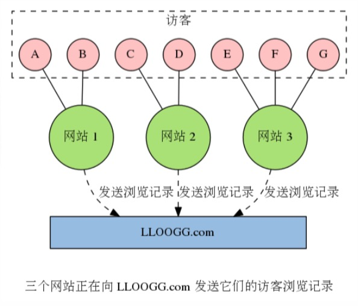
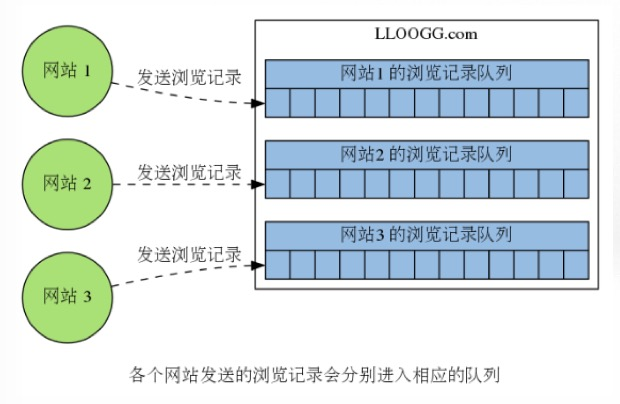
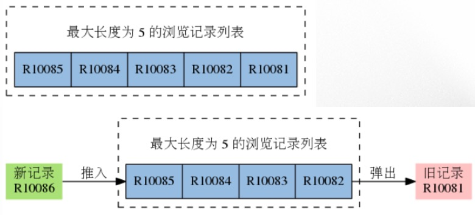
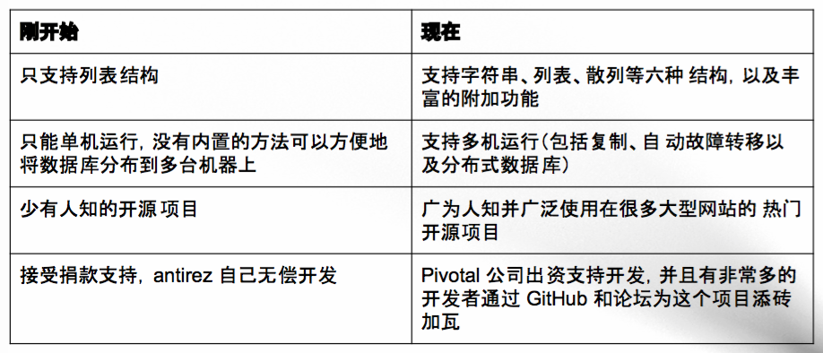

# 简介
## 内容来源
* Redis实战 - 纸质书
* Redis设计与实现 - 电子书
* Redis入门 - 视频
* NoSQL集合 - 视频
* 学术资料

### 相关资料
* 官网:http://redis.io/
* 资料:http://huangz.me/
* 作者:http://invece.org/
## 安装
### 在OSX上安装Redis
直接使用brew命令安装
```
brew install redis # 安装redis
brew services start redis # 设置开机启动
brew install hiredis # 安装hiredis扩展
sudo pip3 install redis # 安装Python客户端
brew cask install rdm # 安装图形化界面客户端
```
### 目标
1. 学会使用Redis的单机和多机功能
2. 学会使用Redis来构建实际的应用程序
3. 学会使用Redis自带的工具以及第三方工具,来维护和管理Redis
4. 了解Redis的实现原理,以便更好,更高效的使用Redis

### 故事
Salvatore Sanfilippo (antirez)在2009年2月26日为了解决网站LLOOGG.com的负载问题发明了Redis.
LLOOGG.com网站目前已经关闭,但是源码已经开放在Github上:https://github.com/antirez/lloogg

** 关于LLOOGG.com **

一个访客信息追踪网站,网站可以通过JS脚本将访客IP,国家,阅览器信息,被访问页面等数据传送给LLOOGG,然后将这些浏览数据通过web页面实时的展示给用户,并存储最新的5到10000条浏览记录以便查阅.

** 网站运作方式 **

为了记录每个被追踪网站的浏览信息,需要为每个被追踪的网站创建一个列表(list),每个列表需要根据用户的设置,存储最新的5到10000条浏览记录.

每当某个被追踪的网站新增一条浏览记录时,LLOOGG就会将这条新的浏览记录推入到与该网站相对应的列表里面,当列表的长度超过用户指定的最大长度时,程序每向列表推入一条新的记录,就需要从列表中弹出(pop)一条最旧的记录.


** LLOOGG的负载问题 **

随着LLOOGG的用户越来越多,要维护的列表数量也越来越多,要执行的推入和弹出操作也越来越多.使用MySQL数据库每次执行推入和弹出操作都要进行硬盘写入和读取,程序的性能严重受制于硬盘I/O.所以在现有硬件的基础上,通过提升列表操作的性能来解决负载问题.

** Redis的诞生 **

为了解决LLOOGG的负载问题,antirez写了一个具有列表结构的内存数据库原型(prototype).这个数据库原型支持O(1)复杂的推入和弹出操作,并将数据存储在内存而不是硬盘,所以程序的性能不会受到硬盘I/O限制,可以极快的速度执行针对列表的推入和弹出操作.之后antirez使用C语言重写了这个内存数据库,并加上了持久化功能,至此Redis就诞生了.

** Redis的演进 **

